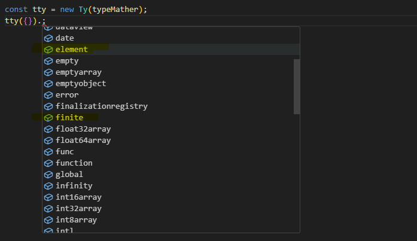

Ty（type-yes） 是个极简的 Javascript 类型判断库（A library for determining the datatype of Javascript variables）

``` bash
npm install type-yes
```

## 🚀 About

首先通过一个例子来认识下 Ty —— 方法的入参类型判断，如：

```js
function func(value) {
    if( value 为 string 或 number 或 为空时 ) {
        ...
    }
}
```

判断方式：

```js
// 方式一：常规版
typeof value === 'string' || typeof value === 'number' || value == null

// 方式二：Lodash 版
_.isString(value) || _.isNumber(value) || _.isNil(value)

// 方式三：Ty 版
Ty(value).str.num.nil.or
```

Ty 版的判断是最简单的！！！，但是也会让人有些疑惑——上述表达式：`Ty(value).str.num.nil.or`，它如何实现判断的？下面分析下：


- **判断参数**：需要判断的量，可以是任意类型

- **类型标识符**：类型的“符号”。str—— string，num —— number,  nil —— null or undefined

- **逻辑运算符**：最终逻辑运算方式。or —— 或运算

上述表达式可以简单理解为：

```
// 当 value = 123

[[value, 'str'], [value, 'num'], [value, 'nil']] ==(判断类型)==> [false, true, false] ==(或运算)==> true
```

到了这里，你大概已经了解 Ty 的逻辑符 or 的使用，除了 or ， Ty 还有  is，not，and，nor，nand


## 🦄 Usage

### is

逻辑”是“判断

```js
// 常规
typeof value === 'number'
// Ty
Ty(value).num.is

// Ty error, 当进行 is 判断时，如果判断参数(或判断标识符)输入多个值时，会报错
Ty(value01, value02).num.is // error
Ty(value).num.str.is // error
```

### not

逻辑”否“判断， is 的取反

```js
// 常规
typeof value != 'number'
// Ty
Ty(value).num.not

// Ty error, 当进行 not 判断时，如果判断参数(或判断标识符)输入多个值时，会报错。与 is 判断相同
```

### or

逻辑”或“判断

```js
// 常规
typeof value === 'string' || typeof value === 'number'
// Ty
Ty(value).str.num.or

// 等价于：
Ty(value, value).str.num.or // 参数会自动补全，所以这样写就“没必要”了
```

### nor

逻辑”或非“判断， or 的取反

```js
// 常规
!(typeof value === 'string' || typeof value === 'number')
// Ty
Ty(value).str.num.nor
```

### and

逻辑“与”判断

示例一：

```js
// 常规
typeof value01 === 'string' && typeof value02 === 'number'
// Ty
Ty(value01, value02).str.num.and
```

示例二：

```js
// 常规
typeof value01 === 'string' && typeof value02 === 'string'
// Ty
Ty(value01, value02).str.and

// 等价于：
Ty(value01, value02).str.str.and // 标识符也会自动补全，所以这样写就“没必要”了
```

### nand

逻辑“与非”判断，and 的取反

```js
// 常规
!(typeof value01 === 'string' && typeof value02 === 'number')
// Ty
Ty(value01, value02).arr.num.nand
```

上述的判断中，除了所有的逻辑操作符的使用方法，我还认识了 num、str 、nil 等类型标识符。在 Ty 中，类型标识符共有 60+，其中包括：**简写类型标识符**、**特殊类型标识符**和**常规类型标识符**，下面我们将一一介绍：

### 简写类型标识符

| 简写标识符 | 对应的常规标识类 | 实际类型                                                     |
| ---------- | ---------------- | ------------------------------------------------------------ |
| obj        | object           | [`Object`](https://developer.mozilla.org/zh-CN/docs/Web/JavaScript/Reference/Global_Objects/Object) （这里的 object, 不包含 array 和 null ） |
| arr        | array            | [`Array`](https://developer.mozilla.org/zh-CN/docs/Web/JavaScript/Reference/Global_Objects/Array) |
| str        | string           | [`String`](https://developer.mozilla.org/zh-CN/docs/Web/JavaScript/Reference/Global_Objects/String) |
| num        | number           | [`Number`](https://developer.mozilla.org/zh-CN/docs/Web/JavaScript/Reference/Global_Objects/Number) |
| bool       | boolean          | [`Boolean`](https://developer.mozilla.org/zh-CN/docs/Web/JavaScript/Reference/Global_Objects/Boolean) |
| undef      | undefined        | [`undefined`](https://developer.mozilla.org/zh-CN/docs/Web/JavaScript/Reference/Global_Objects/undefined) |
| func       | function         | [`Function`](https://developer.mozilla.org/zh-CN/docs/Web/JavaScript/Reference/Global_Objects/Function) |

### 特殊类型标识符

| 标识符      | 实际类型                                                     |
| ----------- | ------------------------------------------------------------ |
| nil         | null 或 undefined                                            |
| empty       | [] 或 {}                                                     |
| emptyobject | {} —— 没有任何属性的空对象                                   |
| emptyarray  | [] —— 没有任何元素的空数组                                   |
| NaN         | [`NaN`](https://developer.mozilla.org/zh-CN/docs/Web/JavaScript/Reference/Global_Objects/NaN) |
| infinity    | [`Infinity`](https://developer.mozilla.org/zh-CN/docs/Web/JavaScript/Reference/Global_Objects/Infinity) 无穷大 |
| primitive   | 原始类型： null, undefined, boolean, number, bigint, string, symbol |

示例:

```js
const isPrimitive = Ty(value).primitive.is // value = Symbol()
const isEmpty = Ty(value).empty.is // value = []
```

### 常规类型标识符

| 标识符               | 实际类型                                                     |
| -------------------- | ------------------------------------------------------------ |
| null                 | null  （不包含 undefined）                                   |
| undefined            | [`undefined`](https://developer.mozilla.org/zh-CN/docs/Web/JavaScript/Reference/Global_Objects/undefined) |
| boolean              | [`Boolean`](https://developer.mozilla.org/zh-CN/docs/Web/JavaScript/Reference/Global_Objects/Boolean) |
| number               | [`Number`](https://developer.mozilla.org/zh-CN/docs/Web/JavaScript/Reference/Global_Objects/Number) |
| string               | [`String`](https://developer.mozilla.org/zh-CN/docs/Web/JavaScript/Reference/Global_Objects/String) |
| bigint               | [`BigInt`](https://developer.mozilla.org/zh-CN/docs/Web/JavaScript/Reference/Global_Objects/BigInt) |
| symbol               | [`Symbol`](https://developer.mozilla.org/zh-CN/docs/Web/JavaScript/Reference/Global_Objects/Symbol) |
| object               | [`Object`](https://developer.mozilla.org/zh-CN/docs/Web/JavaScript/Reference/Global_Objects/Object) （这里的 object, 不包含 array 和 null ） |
| array                | [`Array`](https://developer.mozilla.org/zh-CN/docs/Web/JavaScript/Reference/Global_Objects/Array) |
| function             | [`Function`](https://developer.mozilla.org/zh-CN/docs/Web/JavaScript/Reference/Global_Objects/Function) |
| promise              | [`Promise`](https://developer.mozilla.org/zh-CN/docs/Web/JavaScript/Reference/Global_Objects/Promise) |
| date                 | [`Date`](https://developer.mozilla.org/zh-CN/docs/Web/JavaScript/Reference/Global_Objects/Date) |
| regexp               | [`RegExp`](https://developer.mozilla.org/zh-CN/docs/Web/JavaScript/Reference/Global_Objects/RegExp) |
| map                  | [`Map`](https://developer.mozilla.org/zh-CN/docs/Web/JavaScript/Reference/Global_Objects/Map) |
| set                  | [`Set`](https://developer.mozilla.org/zh-CN/docs/Web/JavaScript/Reference/Global_Objects/Set) |
| ......更多的请看附录 |                                                              |

示例:

```js
const isIterator = Ty(value).array.map.set.or
cosnt isPrimitive = Ty(value).null.undefined.boolean.number.string.bigint.symbol.or
```


## 🔩 More

### 扩展的 Ty 的类型标识符

如果已有的类型标识符不满足时， Ty 支持扩展，只要提供一个 TypeMatcher , 即类型匹配器：

```ts
type TypeMatcher<T extends string> = (parameter: any, typeFlag: T) => boolean;
```

示例（ts）：

```ts
import { Ty, TypeMatcher, TypeFlag, buildinTypeMatcher } from 'ty';

type MyType = 'element' | 'finite' | TypeFlag; // TypeFlag 是 Ty 的所有的类型标识符的一个联合类型
const typeMather: TypeMatcher<MyType> = (parameter, typeFlag) => {  // parameter —— 判断参数， typeFlag —— 类型标识符
  switch (typeFlag) {
    case 'element':
      return parameter instanceof Element;
    case 'finite':
      return Number.isFinite(parameter);
    default:
      return buildinTypeMatcher(parameter, typeFlag); // buildinTypeMatcher —— Ty 内置的类型匹配器
  }
};

const tty = new Ty(typeMather);
```

使用效果（element 和 finite 会出现在拼写提示中）：



### Proxy 如何判断

Proxy 类型是难以判断的——Proxy 代理的对象是什么类型，proxy 实例就判定为相应的类型，如：

```js
const arr = ['a', 'b', 'c'];
const arrProxy = new Proxy(arr, {});
typeof arrProxy; // array
Object.prototype.toString.call(arrProxy); // [object Array]
```

Ty 中，继承 Proxy 实现了一个子类：IdentifiableProxy，这个子类的类型是可以判断的，如：

```js
const arr = ['a', 'b', 'c'];
const arrProxy = new IdentifiableProxy(arr, {});
Object.prototype.toString.call(arrProxy); // [object Proxy-Array]

// 使用 Ty 判断
Ty(arrProxy).proxy.is; // true —— 做 proxy 判断时，arrProxy 判定为 proxy
Ty(arrProxy).array.is; // true —— 做 array 判断时，arrProxy 判定为 array
Ty(arrProxy).array.proxy.and; // true
```

### 类型标识符的“否运算“

如何使用 Ty 实现下面这样一个类型判断：

```js
typeof value01 === 'object' && typeof value02 != 'number'
```

在 Ty 中，可以对单个类型标识符进行否运算：! + 类型标识符，如：

```js
Ty({}, 123).obj['!num'].and // false
Ty({}, 'abc').obj['!num'].and // true
```

### 类型标识符的“可为空运算“

如何使用 Ty 实现下面这样一个类型判断：

```js
typeof value01 === 'object' && (typeof value02 === 'number' || value02 == null)
```

在 Ty 中，可以对单个类型标识符进行可为空运算：? + 类型标识符，如：

```js
Ty({}, 123).obj['?num'].and // true
Ty({}, null).obj['?num'].and // true
```


## 🍩 Appendix

### 常规类型标识符附录

| 标识符                  | 对应类型                                                     |
| ----------------------- | ------------------------------------------------------------ |
| error                   | [`Error`](https://developer.mozilla.org/zh-CN/docs/Web/JavaScript/Reference/Global_Objects/Error) |
| reflect                 | [`Reflect`](https://developer.mozilla.org/zh-CN/docs/Web/JavaScript/Reference/Global_Objects/Reflect) |
| json                    | [`JSON`](https://developer.mozilla.org/zh-CN/docs/Web/JavaScript/Reference/Global_Objects/JSON) |
| math                    | [`Math`](https://developer.mozilla.org/zh-CN/docs/Web/JavaScript/Reference/Global_Objects/Math) |
| int8array               | [`Int8Array`](https://developer.mozilla.org/zh-CN/docs/Web/JavaScript/Reference/Global_Objects/Int8Array) |
| uint8array              | [`Uint8Array`](https://developer.mozilla.org/zh-CN/docs/Web/JavaScript/Reference/Global_Objects/Uint8Array) |
| uint8clampedarray       | [`Uint8ClampedArray`](https://developer.mozilla.org/zh-CN/docs/Web/JavaScript/Reference/Global_Objects/Uint8ClampedArray) |
| int16array              | [`Int16Array`](https://developer.mozilla.org/zh-CN/docs/Web/JavaScript/Reference/Global_Objects/Int16Array) |
| uint16array             | [`Uint16Array`](https://developer.mozilla.org/zh-CN/docs/Web/JavaScript/Reference/Global_Objects/Uint16Array) |
| int32array              | [`Int32Array`](https://developer.mozilla.org/zh-CN/docs/Web/JavaScript/Reference/Global_Objects/Int32Array) |
| uint32array             | [`Uint32Array`](https://developer.mozilla.org/zh-CN/docs/Web/JavaScript/Reference/Global_Objects/Uint32Array) |
| bigint64array           | [`BigInt64Array`](https://developer.mozilla.org/zh-CN/docs/Web/JavaScript/Reference/Global_Objects/BigInt64Array) |
| biguint64array          | [`BigUint64Array` (en-US)](https://developer.mozilla.org/en-US/docs/Web/JavaScript/Reference/Global_Objects/BigUint64Array) |
| float32array            | [`Float32Array`](https://developer.mozilla.org/zh-CN/docs/Web/JavaScript/Reference/Global_Objects/Float32Array) |
| float64array            | [`Float64Array`](https://developer.mozilla.org/zh-CN/docs/Web/JavaScript/Reference/Global_Objects/Float64Array) |
| weakmap                 | [`WeakMap`](https://developer.mozilla.org/zh-CN/docs/Web/JavaScript/Reference/Global_Objects/WeakMap) |
| weakset                 | [`WeakSet`](https://developer.mozilla.org/zh-CN/docs/Web/JavaScript/Reference/Global_Objects/WeakSet) |
| arraybuffer             | [`ArrayBuffer`](https://developer.mozilla.org/zh-CN/docs/Web/JavaScript/Reference/Global_Objects/ArrayBuffer) |
| atomics                 | [`Atomics`](https://developer.mozilla.org/zh-CN/docs/Web/JavaScript/Reference/Global_Objects/Atomics) |
| dataview                | [`DataView`](https://developer.mozilla.org/zh-CN/docs/Web/JavaScript/Reference/Global_Objects/DataView) |
| weakref                 | [`WeakRef`](https://developer.mozilla.org/zh-CN/docs/Web/JavaScript/Reference/Global_Objects/WeakRef) |
| finalizationregistry    | [`FinalizationRegistry` (en-US)](https://developer.mozilla.org/en-US/docs/Web/JavaScript/Reference/Global_Objects/FinalizationRegistry) |
| iterator                | [`Iterator`](https://developer.mozilla.org/zh-CN/docs/Web/JavaScript/Reference/Global_Objects/Iterator) |
| proxy                   | [`Proxy`](https://developer.mozilla.org/zh-CN/docs/Web/JavaScript/Reference/Global_Objects/Proxy) |
| intl                    | [`Intl`](https://developer.mozilla.org/zh-CN/docs/Web/JavaScript/Reference/Global_Objects/Intl) |
| intl.collator           | [`Intl.Collator`](https://developer.mozilla.org/zh-CN/docs/Web/JavaScript/Reference/Global_Objects/Intl/Collator) |
| intl.datetimeformat     | [`Intl.DateTimeFormat`](https://developer.mozilla.org/zh-CN/docs/Web/JavaScript/Reference/Global_Objects/Intl/DateTimeFormat) |
| intl.displaynames       | [`Intl.DisplayNames`](https://developer.mozilla.org/zh-CN/docs/Web/JavaScript/Reference/Global_Objects/Intl/DisplayNames) |
| intl.listformat         | [`Intl.ListFormat`](https://developer.mozilla.org/zh-CN/docs/Web/JavaScript/Reference/Global_Objects/Intl/ListFormat) |
| intl.locale             | [`Intl.Locale`](https://developer.mozilla.org/zh-CN/docs/Web/JavaScript/Reference/Global_Objects/Intl/Locale) |
| intl.numberformat       | [`Intl.NumberFormat`](https://developer.mozilla.org/zh-CN/docs/Web/JavaScript/Reference/Global_Objects/Intl/NumberFormat) |
| intl.pluralrules        | [`Intl.PluralRules`](https://developer.mozilla.org/zh-CN/docs/Web/JavaScript/Reference/Global_Objects/Intl/PluralRules) |
| intl.relativetimeformat | [`Intl.RelativeTimeFormat`](https://developer.mozilla.org/zh-CN/docs/Web/JavaScript/Reference/Global_Objects/Intl/RelativeTimeFormat) |
| intl.segmenter          | [`Intl.Segmenter`](https://developer.mozilla.org/zh-CN/docs/Web/JavaScript/Reference/Global_Objects/Intl/Segmenter) |
| global                  | node 环境下的 globalThis                                     |
| window                  | window 环境下的 globalThis 或 window                         |
